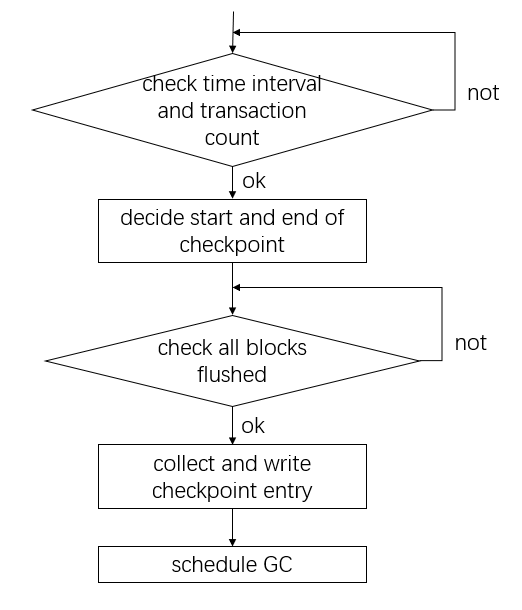

# Checkpoint

## Summary

Checkpoint ensure that changes before a certain timestamp have been flushed to S3, and entries in wal can be truncated.
Checkpoint entry records data in catalog，including data from system table mo_database, mo_tables, mo_columns and metadata from user tables。When generating checkpoint entry, user table have been flushed to S3，checkpoint entry doesn't contain data from user table。There're two kinds of checkpoint: Incremental checkpoint and global checkpoint。Global checkpoint starts from 0 and covers previous checkpoint entries。Increment checkpoint starts from the end of last checkpoint entry，and doesn't overlap with previous checkpoint entry。Incremental checkpoint is cheaper and more frequent than global checkpoint。
Checkpoint entries are consumed when CN collects logtail and DN restarts。

## Motivation

Before making checkpoint, write intents are presisted in WAL. In order to replay faster, we make checkpoint and schedule to persiste data to S3. Entries before checkpoint are no longer needed. We apply WAL entries start from checkpoint.

## Detailed design
### Checkpoint entry
Checkpoint entry is in the form of batches。There three kinds of batch in checkpoint entry: 1. metadata batch, recording metadata of the entry; 2. batch for CN; 3. batch for DN

|||
|-|-|
|metadata batch|Meta|
|batches for CN|DBInsert, DBDelete, TBLInsert, TBLDelete,TBLColInsert, TBLColDelete,BLKMetaInsert, BLKMetaDelete, BLKCNMetaInsert|
|batches for DN|DBInsertTxn, DBDeleteTxn, TBLInsertTxn, TBLDeleteTxn, SEGInsert, SEGDelete, SEGInsertTxn, SEGDeleteTxn, BLKMetaInsertTxn, BLKMetaDeleteTxn, BLKCNMetaInsert|

#### Metadata batch
   To get checkpoint entry in table granularity, metadata batch records address of user table metadata, consist of batch id, offset in batch and length of data.

#### Batches for CN
   These batches are consumed when CN collects logtail. They have the same schema as batches in logtail.
   1. DBInsert, DBDelete: Data from mo_database.
   2. TBLInsert, TBLDelete: Data from mo_tables.
   3. TBLColInsert, TBLColDelete: Data from mo_columns.
   4. BLKMetaInsert, BLKMetaDelete, BLKCNMetaInsert
   
      BLKMetaInsert, BLKMetaDelete, BLKCNMetaInsert are metadata from user table. When loading checkpoint in granularity of table, only small part of batch is required. To reduce IO, BLKMetaInsert, BLKMetaDelete, BLKCNMetaInsert splits to batches. When collecting BLKMetaInsert, BLKMetaDelete, BLKCNMetaInsert, after one user table is finished, it check whether current batch is longer than 10000 rows. If it exceeds the limit, we start a new batch.

#### Batches for DN
   These batches records suplementary information needed when DN restart, including：
   1. transaction information: start TS, prepare TS, end TS and log index
   2. related ids: database id, table id, segment id
   3. segment
      CN doesn't have segmen. Segments are maintained in DN.

#### Checkpoint Metadata
   Checkpoint metadata records location of checkpoint entrys on s3. When CN requests logtail, it get checkpoint metadata from memory. Checkpoint metadata is persisted on s3 under directory ckp. Once a checkpoint entry is persisted, it generates a new checkpoint metadata file, recording location of all the checkpoint entries. The new metadata file can cover previous metadata files. We start to GC previous metadata files onece new file is persisted. Commonly, there're only one or two files under /ckp. When DN restart, it scan /ckp to get location of checkpoint entries.

#### Generate checkpoint

Checkpoint is scheduled by checkpoint runner. Checkpoint runner try schedule checkpoint each `scan-interval`.

* Start a checkpoint requires：
  1. Time since previous checkpoint is longer than intervel in config (e.i. `global-interval` and `incremental-interval`).
  2. Write transactions are more than `min-count` since last checkpoint.
     Once meeting above two requirements, it decides start and end timestamp of checkpoint. Global checkpoint starts from 0. Incremental checkpoint starts from the end of last checkpoint. Both kinds of checkpoint ends at current timestamp.
  3. All changes between start and end has been flushed to S3.

* Collect checkpoint entry
  
    Checkpoint entry is collected from catalog. It scans catalog and collect changes between start and end. When collecting user table metadata, it records the mapping of table id and address of data in checkpoint entry. After scan is finished, the mapping is writed to meta batch.

* Write to S3

    Checkpoint entry and checkpoint metadata are presisted to S3. Each checkpoint entry is a S3 object. Its location is recorded in checkpoint metadata. 

* GC

1. checkpoint entries
    Global checkpoint entry can cover all previous checkpoint entries. In global checkpoint, we schedule a task to GC previous checkpoint entries.

2. checkpoint metadata
   New checkpoint metadata file contains metadata of all checkpoint entries and can covers all the previous metadata file. After one checkpoint metadata file is persisted, we schedule to GC checkpoint metadata

3. WAL entries
    Log entries before endTS are no longer needed. After checkpoint, we get lsn from logtail by endTS and truncate entries in Wal.

#### Consume checkpoint

1. replay in CN

   1. collect checkpoint
      It choose all checkpoints overlaping with (cn have, cn want]. e.g. If CN requires [35,45], checkpoint[30,40][40,50][50,60] are choosen.
   2. send to CN
      Locations of checkpoints are sent to CN through RPC as `CkpLocation`.
   3. load checkpoint entry
      Checkpoint entry is loaded through 3 IO: 1. read object metadata; 2. read checkpoint entry metadata batch, which records the mapping of table id and address of its data in the checkpoint entry; 3. read data batches, like BLKMetaInsert, BLKMetaDelete, BLKCNMetaInsert.
   4. apply to CN
      Batches in checkpoint entry have the same schema as other logtails. The data batches are filled in api.Entry and apply to CN.

2. replay in DN
   1. load checkpoint entry
      There're 4 IO: 1. scan ckp/ and read object metadata of checkpoint metadata file 2. read checkpoint metadata and get locations of checkpoint entries 3. read object metadata of checkpoint entry 4. read checkpoint entries
   2. apply checkpoint
      DN catalog consists of catalog entries. There're four kindes of entries: database, table, segment and block. One entry has several versions. One version for each transaction. A row in checkpoint entry is a version. Checkpoint entries are applied in the order of database, table, segment, block. It deals with idempotence by catalog entry id and startTS of the transaction. When apply database and table entries, it doesn't check duplication of name.
   3. After checkpoint is applied, it records end timestamp of last checkpoint. WAL is applied start from this timestamp.