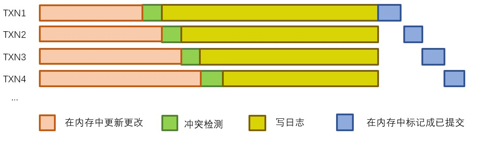
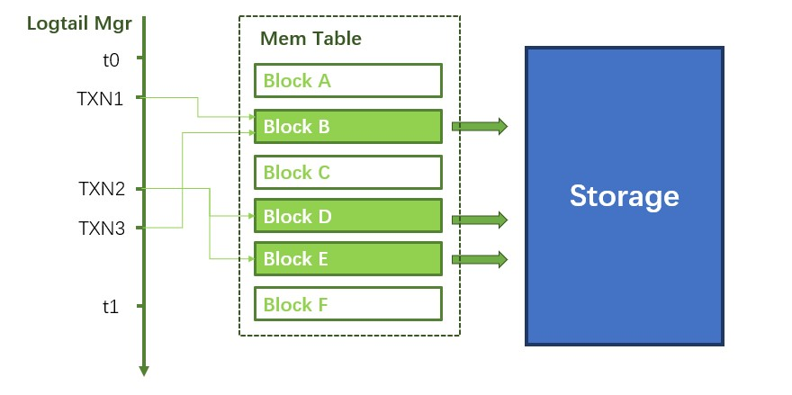
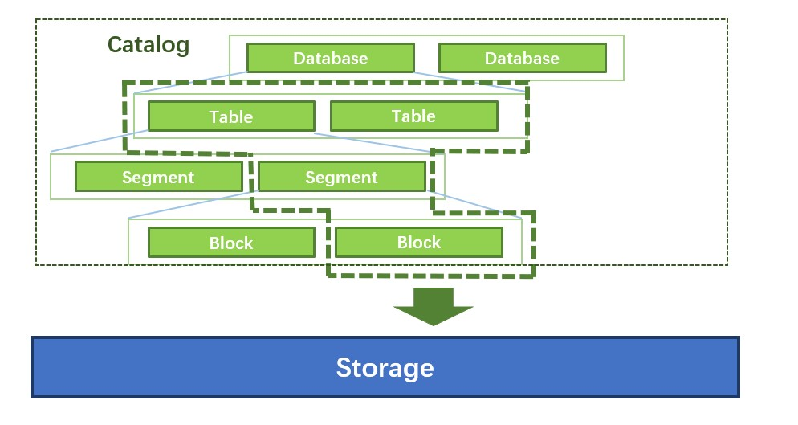
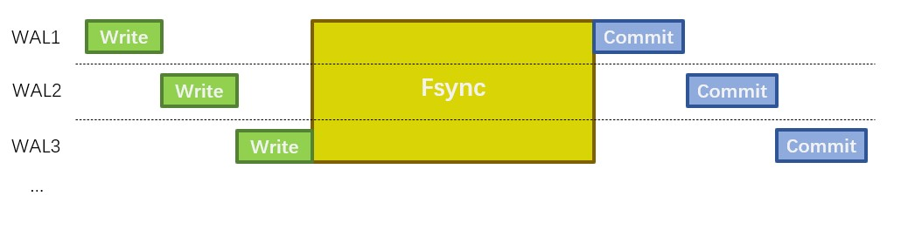
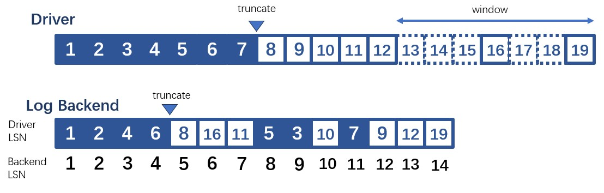

# MatrixOne WAL设计解析

WAL(Write Ahead Log)是一项与数据库原子性和持久性相关的技术，在事务提交时把随机写转换成顺序读写。事务的更改随机地发生在各页上，这些页很分散，随机写的开销大于顺序写，会降低提交的性能。WAL只记录事务的更改操作，类似于在哪个block中增加了哪行。提交事务时新的WAL entry顺序地写在WAL文件末尾。提交之后再异步地更新那些脏页，销毁对应的WAL entry，释放空间。MatrixOne的WAL是物理日志，记录每行更新发生的位置，每次回放出来，数据不仅在逻辑上相同，底层的组织结构也是一样的。

下面是本文目录概览：
1. Commit Pipeline
2. Checkpoint
3. Log Backend
4. Group Commit
5. 处理Log Backend的乱序LSN
6. MatrixOne中WAL的具体格式


## Commit Pipeline

Commit Pipeline是处理事务提交的组件。提交之前要更新memtable，持久化WAL entry，执行这些任务的耗时决定了提交的性能。持久化WAL entry涉及到IO，比较耗时。MatrixOne中采用commit pipeline，异步持久化WAL entry，不阻塞内存中的更新。



事务提交的流程是：
1. 把更改更新到memtable中
   
   事务进入commit pipeline之前，先并发更新memtable，事务之间互相不阻塞。这时这些更改的状态为未提交，不对任何事务不可见。
2. 进入commit pipeline检查冲突
3. 持久化WAL entry
   
   从内存收集WAL entry写到后端。持久化WAL entry是异步的，队列里只把WAL entry传给后端就立刻返回，不用等待写入成功，这样不会阻塞后续其他事务。后端同时处理一批entry，通过Group Commit进一步加速持久化。
4. 更新memtable中的状态使事务可见
   
   事务按照进队列的顺序依次更新状态，这样事务可见的顺序和队列里写WAL entry的顺序是一致的。

## Checkpoint

Checkpoint将脏数据写入Storage，销毁旧的log entry，释放空间。MatrixOne中，checkpoint是一个后台发起的任务，它的流程是：
1. 选定一个合适的时间戳作为checkpoint，然后扫描时间戳之前的修改。图上的t0是上个checkpoint，t1是当前选定的checkpoint。[t0,t1]之间发生的更改需要转存。

2. 转存DML修改。DML更改存在memtable中的各个block中。Logtail Mgr是一个内存模块，记录着每个事务改动了哪些block。在Logtail Mgr上扫描[t0,t1]之间的事务，发起后台事务把这些block转存到Storage上，在元数据中记录地址。这样，所有t1前提交的DML更改都能通过元数据中的地址查到。为了及时做checkpoint，不让WAL无限增长，哪怕区间中block只改动了一行，也需要转存。



3. 扫描Catalog转存DDL和元数据更改。Catalog是一棵树，记录了所有的DDL和元数据信息，树上的每个节点都会记录更改发生的时间戳。扫描时收集所有落在[t0,t1]之间的更改。



4. 销毁旧的WAL entry。Logtail Mgr中存了每个事务对应的LSN。根据时间戳，找到t1前最后一个事务，然后通知Log Backend清理这个事务的LSN之前的所有日志。

## Log Backend
MatrixOne的WAL能写在各种Log Backend中。最初的Log Backend基于本地文件系统。为了分布式特性，我们自研了高可靠低延迟Log Service作为新的Log Backend。Driver层被抽象出来，适配不同的Log Backend。经过适配，Kafka也能作为Log Backend。

   Driver需要适配出这些接口：
  1. Append，提交事务时异步地写入log entry
   ```
    Append(entry) (Lsn, error)
   ```
  2. Read，重启时批量读取log entry
   ```
	Read(Lsn, maxSize) (entry, Lsn, error)
   ```
  3. Truncate接口会销毁LSN前的所有log entry，释放空间。
   ```
	Truncate(lsn Lsn) error
   ```
## Group Commit

  Group Commit可以加速持久化log entry。持久化log entry涉及到IO，非常耗时，经常是提交的瓶颈。为了降低延迟，批量向Log Backend中写入log entry。比如，在文件系统中fsync耗时很久。如果每条entry都fsync，会耗费大量时间。基于文件系统的Log Backend中，多个entry写完后统一只做一次fsync，这些entry刷盘的时间成本之和近似一条entry刷盘的时间。
  


Log Service中支持并发写入，各条entry刷盘的时间可以重叠，这也能缩短写entry的总时间，提高了提交的并发。

## 处理Log Backend的乱序LSN
为了加速，MatrixOne向Log Backend并发写入entry，写入成功的顺序和发出请求的顺序不一致，导致Log Backend中产生LSN和逻辑LSN不一致。Truncate和重启的时候要处理这些乱序LSN。为了保证Log Backend中的LSN基本有序，乱序的跨度不要太大，Driver中维持了一个窗口，如果有很早的log entry正在写入还未成功，会停止向Log Backend写入新的entry。例如，如果窗口的长度是7，图中的LSN为13的entry还未返回，会阻塞住LSN大于等于20的entry。



Driver收到上层传来的LSN，算出对应的Log Backend LSN，通知Log Backend做truncate。Log Backend中通过truncate操作销毁日志，销毁指定LSN之前的所有entry。这个LSN之前的entry所对应的Driver LSN都要小于Driver中的truncate点。比如图中Driver里truncate到7，这条entry对应Log Backend中的11，但是Log Backend中5，6，7，10对应的Driver LSN都大于7，不能被truncate。Log Backend只能truncate 4。

重启时，会跳过开始和末尾那些不连续的entry。比如图上的Log Backend写到14时，整个机器断电了，重启时会根据上次的truncate信息过滤掉开头8，9，11。等读完所有的entry发现6，14的Driver LSN和其他的entry不连续，就丢弃末尾的6和14。


## MatrixOne中WAL的具体格式

每个写事务对应一条log entry，由LSN，Transaction Context和多个Command组成。

```
+---------------------------------------------------------+
|                  Transaction Entry                      |
+-----+---------------------+-----------+-----------+-   -+
| LSN | Transaction Context | Command-1 | Command-2 | ... |
+-----+---------------------+-----------+-----------+-   -+
```

### LSN 
每条log entry对应一个LSN。LSN连续递增，在做checkpoint时用来删除entry。

### Transaction Context

   Transaction Context里记录了事务的信息。
   ```
   +---------------------------+
   |   Transaction Context     |
   +---------+----------+------+
   | StartTS | CommitTS | Memo |
   +---------+----------+------+
   ```
   1. StartTS和CommitTS分别是事务开始和结束的时间戳。
   2. Memo记录事务更改了哪些地方的数据。重启的时候，会把这些信息恢复到Logtail Mgr里，做checkpoint要用到这些信息。

### Transaction Commands
   
  事务中每种写操作对应一个或多个command。log entry会记录事务中所有的command。

  | Operator      | Command        |
  | ------------- | -------------- |
  | DDL           | Update Catalog |
  | Insert        | Update Catalog |
  |               | Append         |
  | Delete        | Delete         |
  | Compact&Merge | Update Catalog |

#### Operators

MatrixOne中DN负责提交事务，向Log Backend中写log entry，做checkpoint。DN支持建库，删库，建表，删表，更新表结构，插入，删除，同时后台会自动触发排序。更新操作被拆分成插入和删除。

1. DDL
   
   DDL包括建库，删库，建表，删表，更新表结构。DN在Catalog里记录了表和库的信息。内存里的Catalog是一棵树，每个结点是一条catalog entry。catalog entry有4类，database，table，segment和block，其中segment和block是元数据，在插入数据和后台排序的时候会变更。每条database entry对应一个库，每条table entry对应一张表。每个DDL操作对应一条database/table entry，在entry里记录成Update Catalog Command。
2. Insert
   
   新插入的数据记录在Append Command中。
   DN中的数据记录在block中，多个block组成一个segment。如果DN中没有足够的block或segment记录新插入的数据，就会新建一个。这些变化记录在Update Catalog Command中。
   大事务中，由CN直接把数据写入S3，DN只提交元数据。这样，Append Command中的数据不会很大。
3. Delete
   
   DN记录Delete发生的行号。读取时，先读所有插入过的数据，然后再减去这些行。事务中，同一个block上所有的删除合并起来，对应一个Delete Command。
4. Compact & Merge
   
   DN后台发起事务，把内存里的数据转存到s3上。把S3上的数据按主键排序，方便读的时候过滤。
   compact发生在一个block上，compact之后block内的数据是有序的。merge发生在segment里，会涉及多个block，merge之后整个segment内有序。
   compact/merge前后的数据不变，只改变元数据，删除旧的block/segment，创建新的block/segment。每次删除/创建对应一条Update Catalog Command。

#### Commands
  1. Update Catalog

     Catalog从上到下每层分别是database，table，segment和block。一条Updata Catalog Command对应一条Catalog Entry。每次ddl或者跟新元数据对应一条Update Catalog Command。Update Catalog Command包含Dest和EntryNode。
     ```
     +-------------------+
     |   Update Catalog  |
     +-------+-----------+
     | Dest | EntryNode |
     +-------+-----------+
     ```
     * Dest

       Dest是这条Command作用的位置，记录了对应结点和他的祖先结点的id。重启的时候会通过Dest，在Catalog上定位到操作的位置。
       | Type            | Dest                                       |
       | --------------- | ------------------------------------------- |
       | Update Database | database id                                 |
       | Update Table    | database id, table id                       |
       | Update Segment  | database id, table id, segment id           |
       | Update Block    | database id, table id, segment id, block id |
     * EntryNode
       * 每个EntryNode都记录了entry的创建时间和删除时间。如果entry没被删除，删除时间为0。如果当前事务正在创建或者删除，对应的时间为`UncommitTS`。
         ```
         +-------------------+
         |    Entry Node     |
         +---------+---------+
         | Create@ | Delete@ |
         +---------+---------+
         ```
       * 对于segment和block，Entry Node还记录了metaLoc，deltaLoc，分别是数据和删除记录在S3上的地址。
          ```
           +----------------------------------------+
           |               Entry Node               |
           +---------+---------+---------+----------+
           | Create@ | Delete@ | metaLoc | deltaLoc |
           +---------+---------+---------+----------+
          ```
       * 对于table，Entry Node还记录了表结构schema。
          ```
           +----------------------------+
           |         Entry Node         |
           +---------+---------+--------+
           | Create@ | Delete@ | schema |
           +---------+---------+--------+
          ```
  2. Append
   
     Append Command中记录了插入的数据和和这些数据的位置。
     ```
     +-------------------------------------------+
     |             Append Command                |
     +--------------+--------------+-   -+-------+
     | AppendInfo-1 | AppendInfo-2 | ... | Batch |
     +--------------+--------------+-   -+-------+
     ```
     * Batch是插入的数据
     * AppendInfo
       一个Append Data Command中的数据可能跨多个block。每个block对应一个Append Info，记录了数据在Command的Batch中的位置`pointer to data`，还有数据在block中的位置`destination`。
       ```
       +------------------------------------------------------------------------------+
       |                              AppendInfo                                      |
       +-----------------+------------------------------------------------------------+
       | pointer to data |                     destination                            |
       +--------+--------+-------+----------+------------+----------+--------+--------+
       | offset | length | db id | table id | segment id | block id | offset | length |
       +--------+--------+-------+----------+------------+----------+--------+--------+
       ```


  3. Delete Command
   
     每个Delete Command只包含一个block中的删除。
     ```
     +---------------------------+
     |      Delete Command       |
     +-------------+-------------+
     | Destination | Delete Mask |
     +-------------+-------------+
     ```
     * Destination记录Delete发生在哪个Block上。
     * Delete Mask记录删除掉的行号。

##
WAL在存储系统中应用得十分广泛。WAL把随机写转换成顺序写，是一种更高效的模式。WAL内部还有很多执行细节，我们会不断调整，不断优化。
