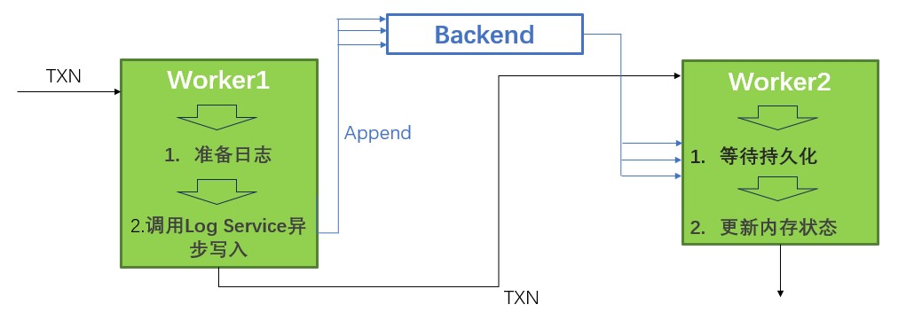
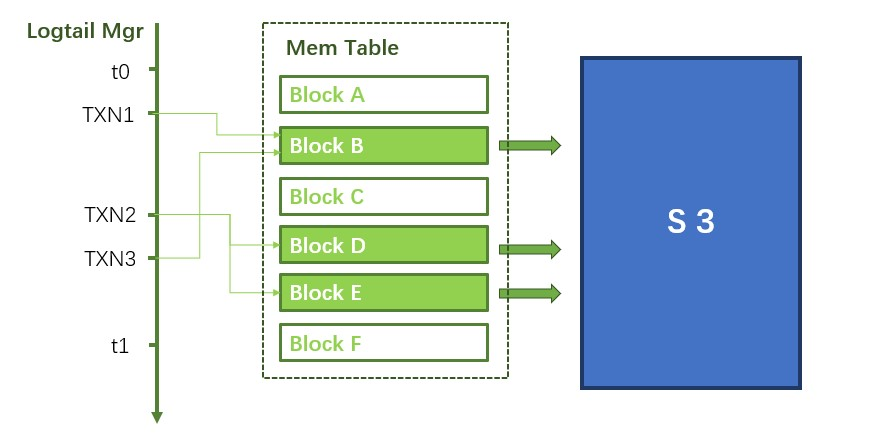
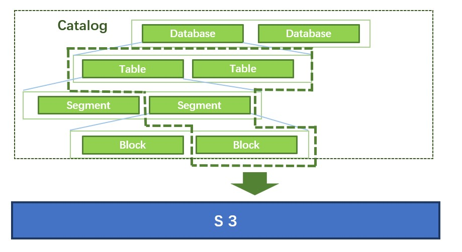

# WAL

为了在能在重启时完整地恢复出所有数据，事务要在提交前持久化。TAE中最新的数据先用WAL(Write Ahead Log)持久化到一个Backend中。后台会定期发起事务，转存这些改动到S3上，然后通知Backend销毁掉旧的WAL。


## 提交流程
TAE先把事务的改动更新到内存，检查冲突，然后为确认不会回滚的事务写WAL日志，确认日志持久化后，更新内存中的状态，标志成已提交。



为了减少延迟，提交队列的pipelie中，worker1准备好日志后，异步调用Backend的Append接口，不等待Append成功，直接把事务交给下一个worker，然后开始处理下一个事务。目前有两种Backend。一种是基于本地磁盘的Batch Store。还有基于raft的分布式的Log Service。支持并发写入的Backend，能进一步加快提交。

## Checkpoint

DN会选一个合适的时间戳t1作为checkpoint，然后扫描t1之前，上个checkpoint t0之后的区间，转存区间中的修改。



DN先转存DML修改。Logtail Mgr中记录着每个事务改动了哪些block。DN扫描[t0,t1]之间的事务涉及的block，发起后台事务把这些block转存到S3上，在元数据中记录地址。这样，所有t1前提交的DML更改都能通过元数据中的地址查到。



然后扫描Catalog，收集[t0,t1]之间的DDL和元数据更改，转存到S3上。Logtail Mgr中存了每个事务对应的WAL LSN。根据时间戳，找到t1前最后一个事务，然后通知LBackend清理这个LSN之前的所有日志。

## WAL格式

每个写事务对应一条WAL日志，由LSN，Transaction Context和多个Command组成。

```
+---------------------------------------------------------+
|                  Transaction Entry                      |
+-----+---------------------+-----------+-----------+-   -+
| LSN | Transaction Context | Command-1 | Command-2 | ... |
+-----+---------------------+-----------+-----------+-   -+
```

### LSN 
每条WAL对应一个LSN。LSN连续递增，在做checkpoint时用来删除WAL。

### Transaction Context

   Transaction Context里记录了事务的信息。
   ```
   +---------------------------+
   |   Transaction Context     |
   +---------+----------+------+
   | StartTS | CommitTS | Memo |
   +---------+----------+------+
   ```
   1. StartTS和CommitTS分别是事务开始和结束的时间戳。
   2. Memo记录事务更改了哪些地方的数据。重启的时候，会把这些信息恢复到Logtail Mgr里，做checkpoint要用到这些信息。

### Transaction Commands
   
  事务中每种写操作对应一个或多个command。WAL日志会记录事务中所有的command。

  | Operator      | Command        |
  | ------------- | -------------- |
  | DDL           | Update Catalog |
  | Insert        | Update Catalog |
  |               | Append         |
  | Delete        | Delete         |
  | Compact&Merge | Update Catalog |

#### Operators

DN支持建库，删库，建表，删表，更新表结构，插入，删除，同时后台会自动触发排序。更新操作被拆分成插入和删除。

1. DDL
   
   DDL包括建库，删库，建表，删表，更新表结构。DN在Catalog里记录了表和库的信息。内存里的catalog是一棵树，每个结点是一条catalog entry。catalog entry有4类，database，table，segment和block，其中segment和block是元数据，在插入数据和后台排序的时候会变更。每条database entry对应一个库，每条table entry对应一张表。每个DDL操作对应一条database/table entry，在WAL里记录成Update Catalog Command。
2. Insert
   
   新插入的数据记录在Append Command中。
   DN中的数据记录在block中，多个block组成一个segment。如果DN中没有足够的block或segment记录新插入的数据，就会新建一个。这些变化记录在Update Catalog Command中。
   大事务中，由CN直接把数据写入S3，DN只提交元数据。这样，Append Command中的数据不会很大。
3. Delete
   
   DN记录Delete发生的行号。读取时，先读所有插入过的数据，然后再减去这些行。事务中，同一个block上所有的删除合并起来，对应一个Delete Command。
4. Compact & Merge
   
   DN后台发起事务，把内存里的数据转存到s3上。把S3上的数据按主键排序，方便读的时候过滤。
   compact发生在一个block上，compact之后block内的数据是有序的。merge发生在segment里，会涉及多个block，merge之后整个segment内有序。
   compact/merge前后的数据不变，只改变元数据，删除旧的block/segment，创建新的block/segment。每次删除/创建对应一条Update Catalog Command。

#### Commands
  1. Update Catalog

     Catalog从上到下每层分别是database，table，segment和block。一条Updata Catalog Command对应一条Catalog Entry。每次ddl或者跟新元数据对应一条Update Catalog Command。Update Catalog Command包含Dest和EntryNode。
     ```
     +-------------------+
     |   Update Catalog  |
     +-------+-----------+
     | Dest | EntryNode |
     +-------+-----------+
     ```
     * Dest

       Dest是这条Command作用的位置，记录了对应结点和他的祖先结点的id。重启的时候会通过Dest，在Catalog上定位到操作的位置。
       | Type            | Dest                                       |
       | --------------- | ------------------------------------------- |
       | Update Database | database id                                 |
       | Update Table    | database id, table id                       |
       | Update Segment  | database id, table id, segment id           |
       | Update Block    | database id, table id, segment id, block id |
     * EntryNode
       * 每个EntryNode都记录了entry的创建时间和删除时间。如果entry没被删除，删除时间为0。如果当前事务正在创建或者删除，对应的时间为`UncommitTS`。
         ```
         +-------------------+
         |    Entry Node     |
         +---------+---------+
         | Create@ | Delete@ |
         +---------+---------+
         ```
       * 对于segment和block，Entry Node还记录了metaLoc，deltaLoc，分别是数据和删除记录在S3上的地址。
          ```
           +----------------------------------------+
           |               Entry Node               |
           +---------+---------+---------+----------+
           | Create@ | Delete@ | metaLoc | deltaLoc |
           +---------+---------+---------+----------+
          ```
       * 对于table，Entry Node还记录了表结构schema。
          ```
           +----------------------------+
           |         Entry Node         |
           +---------+---------+--------+
           | Create@ | Delete@ | schema |
           +---------+---------+--------+
          ```
  2. Append
   
     Append Command中记录了插入的数据和和这些数据的位置。
     ```
     +-------------------------------------------+
     |             Append Command                |
     +--------------+--------------+-   -+-------+
     | AppendInfo-1 | AppendInfo-2 | ... | Batch |
     +--------------+--------------+-   -+-------+
     ```
     * Batch是插入的数据
     * AppendInfo
       一个Append Data Command中的数据可能跨多个block。每个block对应一个Append Info，记录了数据在Command的Batch中的位置`pointer to data`，还有数据在block中的位置`destination`。
       ```
       +------------------------------------------------------------------------------+
       |                              AppendInfo                                      |
       +-----------------+------------------------------------------------------------+
       | pointer to data |                     destination                            |
       +--------+--------+-------+----------+------------+----------+--------+--------+
       | offset | length | db id | table id | segment id | block id | offset | length |
       +--------+--------+-------+----------+------------+----------+--------+--------+
       ```


  3. Delete Command
   
     每个Delete Command只包含一个block中的删除。
     ```
     +---------------------------+
     |      Delete Command       |
     +-------------+-------------+
     | Destination | Delete Mask |
     +-------------+-------------+
     ```
     * Destination记录Delete发生在哪个Block上。
     * Delete Mask记录删除掉的行号。